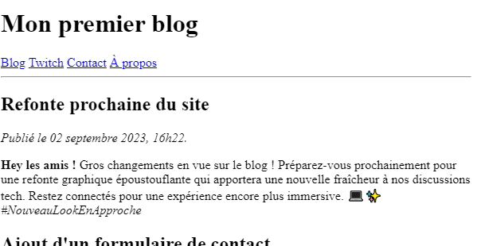

# **Exercice 5 - HTML**

 - Une barre de navigation vers les autres pages ainsi qu'un nouvel article ont été ajoutés (voir exo5_data) 
    - Pour l'instant, ne redirigez vers aucune page pour le lien "A propos".
 - Avec vos nouvelles connaissances, construisez une vraie architecture à votre page principale, elle doit comporter les balises:
`<main>, <header>, <section>, <article>, <nav>` et `<footer>`.
Votre page peut également comporter des `
` et des ``.

---
## **Page principale**

---
